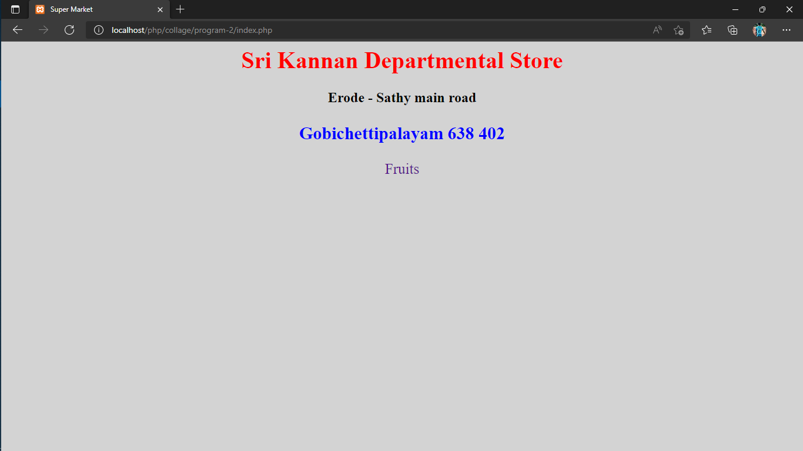
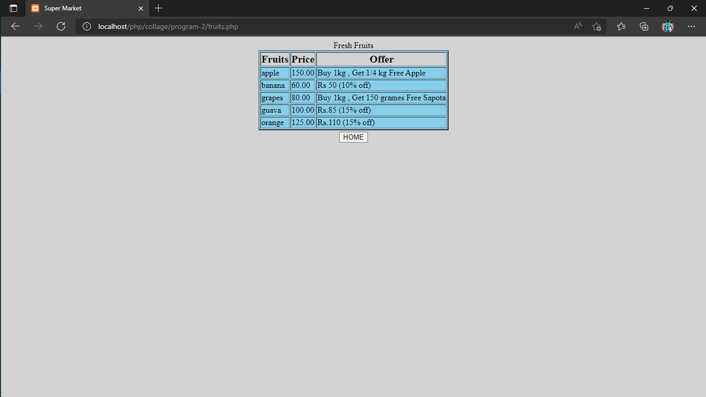

# Webpage preview:





##  Database Query's :

```sql
mysql> create database marketdb;

mysql> use marketdb;

mysql> create table fruits(name varchar(30) primary key , price float(5,2),offer varchar(70));

mysql> insert into fruits values("banana",60,"Rs 50 (10% off)");

mysql> insert into fruits values("apple",150,"Buy 1kg , Get 1/4 kg Free Apple");

mysql> insert into fruits values("grapes",80,"Buy 1kg , Get 150 grames Free Sapota")

mysql> insert into fruits values("orange",125,"Rs.110 (15% off)");

mysql> insert into fruits values("guava",100,"Rs.85 (15% off)");

```
