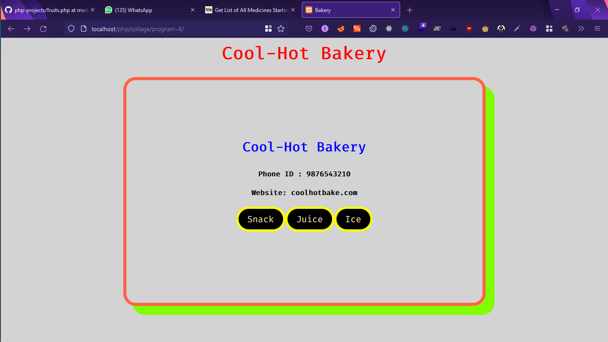
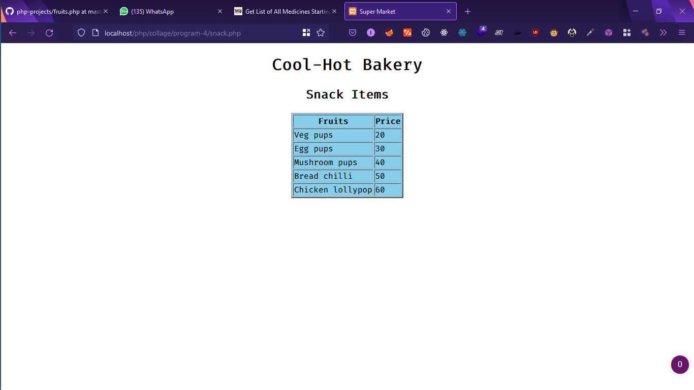
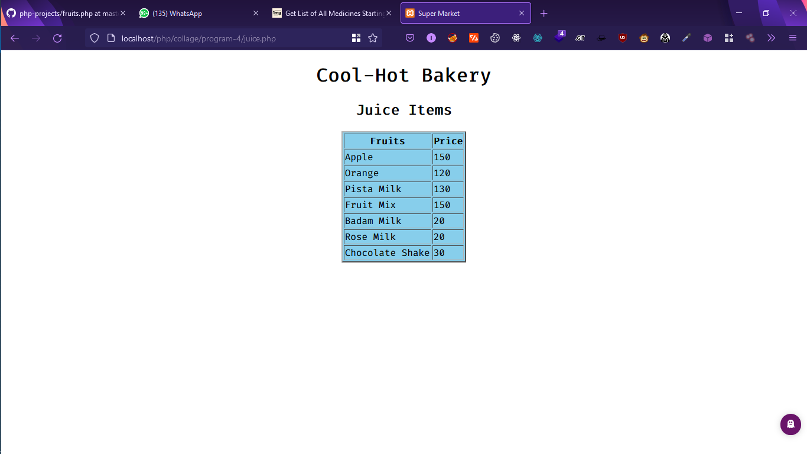
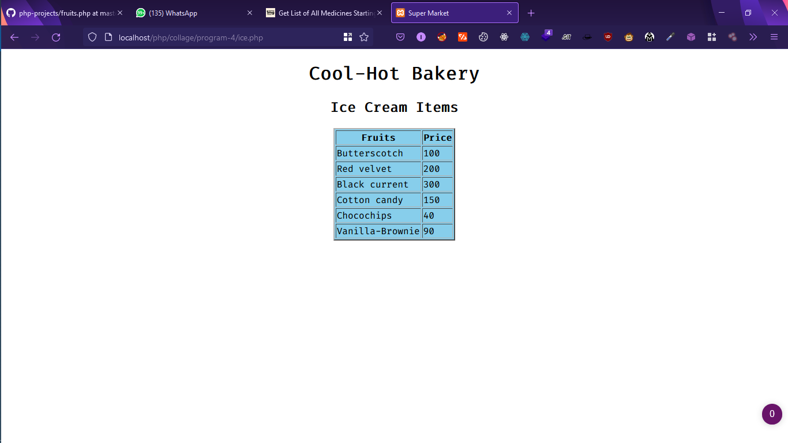

# Webpage Preview









---
# Database Code :)

```sql
mysql> create database bakery;

mysql> use bakery;

mysql> create table snack(name varchar(30) , price int);

mysql> create table juice(name varchar(30) , price int);

mysql> create table ice(name varchar(30) , price int);

```

## Icecreams
```sql
insert into ice values("Butterscotch" , 100);
insert into ice values("Red velvet" , 200);
insert into ice values("Black current" , 300);
insert into ice values("Cotton candy" , 150);
insert into ice values("Chocolate ", 120)
insert into ice values("Gulfi ", 60);
insert into ice values("Chocochips ", 40);
insert into ice values("Vanilla-Brownie ", 90);
```


## Juices
```sql

insert into juice values("Apple" , 150 );
insert into juice values("Orange" , 120 );
insert into juice values("Pista Milk ", 130 );
insert into juice values("Fruit Mix ", 150);
insert into juice values("Badam Milk ", 20);
insert into juice values("Rose Milk ", 20);
insert into juice values("Chocolate Shake ", 30 );

```

## Snacks
```sql

insert into snack values("Veg pups" , 20);
insert into snack values("Egg pups" , 30);
insert into snack values("Mushroom pups" , 40);
insert into snack values("Bread chilli" ,50);
insert into snack values("Chicken lollypop" ,60);

```