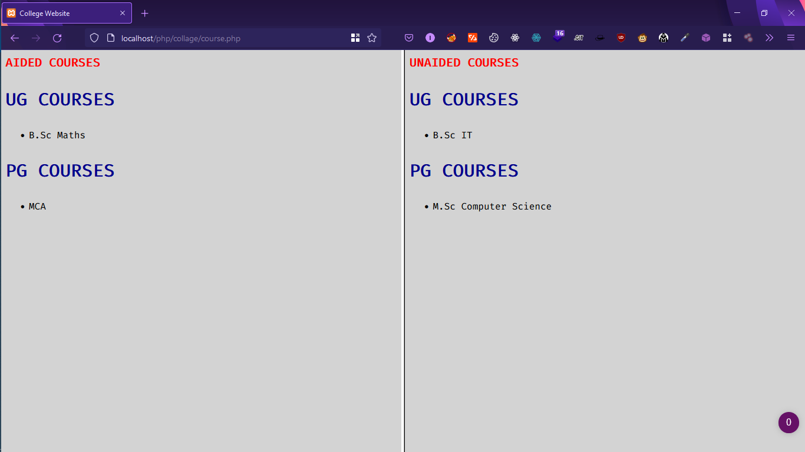

# Webpage Preview

---
# Database Code :)

## Step 1 : Create Database
` create database webdb; `

## Step 2 : Select database
`use webdb;`

## Step 3 : Create table for ug aided
` CREATE TABLE ugaid(course varchar(30) primary key); `

## Step 4 : Insert data into ug aided table
` INSERT INTO ugaid VALUES("B.Sc Maths"); `

## Step 5 : Create table for pg aided
` CREATE TABLE pgaid(course varchar(30) primary key); `

## Step 6 : Insert data into pg aided table
` INSERT INTO pgaid VALUES("MCA"); `

## Step 7 : Create table for ug unaided
` CREATE TABLE ugunaid(course varchar(30) primary key); `

## Step 8 : Insert data into ug unaided table
` INSERT INTO ugunaid VALUES("B.Sc IT"); `

## Step 9 : Create table for pg unaided
` CREATE TABLE pgunaid(course varchar(30) primary key); `

## Step 10 : Insert data into pg aided table
` INSERT INTO pgunaid VALUES("M.Sc Computer Science"); `

---